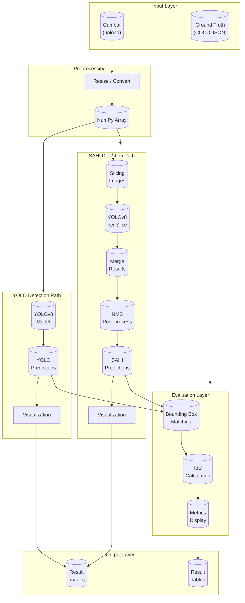
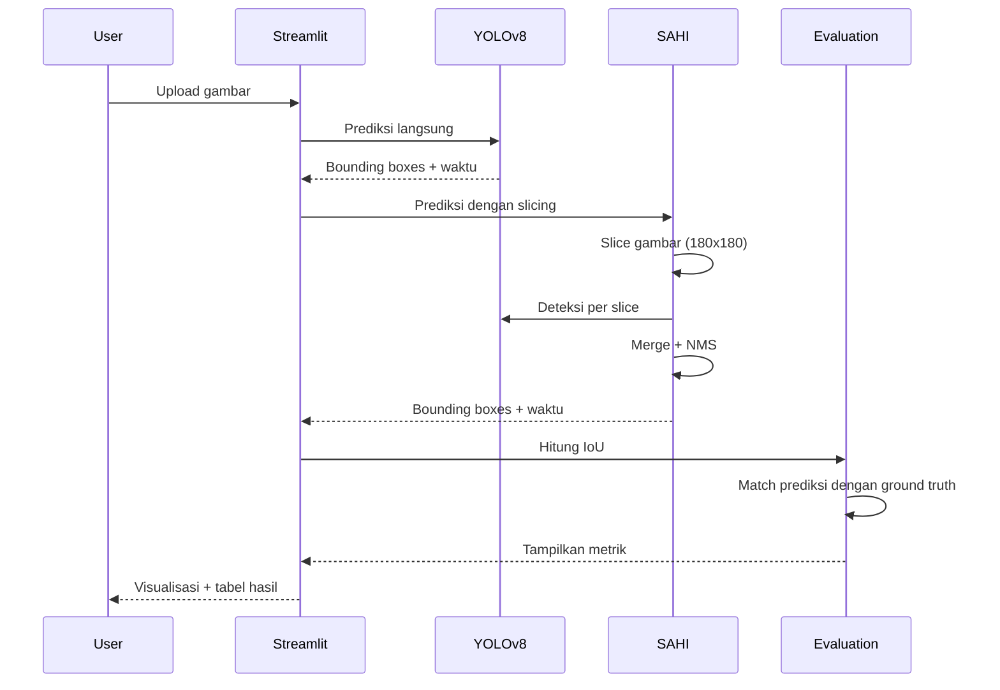

# Deteksi Wajah Menggunakan SAHI

Sistem deteksi wajah menggunakan teknik SAHI (Sliced Aided Hyper Inference) dengan model YOLOv8, dibangun menggunakan Streamlit untuk antarmuka pengguna yang interaktif.

## Daftar Isi

- [Gambaran Proyek](#gambaran-proyek)
- [Arsitektur Sistem](#arsitektur-sistem)
- [Instalasi](#instalasi)
- [Struktur Proyek](#struktur-proyek)
- [Penggunaan](#penggunaan)
- [Fitur](#fitur)
- [Model dan Dataset](#model-dan-dataset)
- [Lisensi](#lisensi)

---

## Gambaran Proyek

Proyek ini merupakan sistem deteksi wajah yang menggabungkan teknologi:

- **YOLOv8**: Model deteksi objek state-of-the-art dari Ultralytics
- **SAHI**: Teknik slicing untuk deteksi objek kecil pada gambar resolusi tinggi
- **Streamlit**: Framework untuk membangun aplikasi web interaktif

Sistem ini memungkinkan pengguna mengunggah gambar dan mendapatkan deteksi wajah menggunakan dua metode (YOLO langsung dan SAHI), beserta metrik evaluasi seperti IoU (Intersection over Union) dan waktu deteksi.

---

## Arsitektur Sistem



### Alur Proses



---

## Instalasi

### Persyaratan Sistem

- Python 3.8+
- CUDA-capable GPU (untuk akselerasi GPU)

### Clone Repository

```bash
git clone https://github.com/username/Deteksi-Wajah-Menggunakan-SAHI.git
cd Deteksi-Wajah-Menggunakan-SAHI
```

### Buat Virtual Environment (Opsional)

```bash
python -m venv venv
# Windows
venv\Scripts\activate
# Linux/Mac
source venv/bin/activate
```

### Install Dependencies

```bash
pip install -r requirements.txt
```

File `requirements.txt` harus berisi:

```
streamlit>=1.28.0
ultralytics>=8.0.0
sahi>=0.11.0
pycocotools>=2.0.0
Pillow>=10.0.0
numpy>=1.24.0
scipy>=1.10.0
matplotlib>=3.7.0
pandas>=2.0.0
torch>=2.0.0
torchvision>=0.15.0
```

### Download Model

Model YOLOv8 yang digunakan:

- `yolov8l_100e.pt` - Large model (sudah tersedia di repo)
- `yolov8n_100e.pt` - Nano model
- `yolov850.pt` - Variant lain

Untuk menggunakan model lain:

```bash
# Download model dari Ultralytics
from ultralytics import YOLO
model = YOLO('yolov8n.pt')  # nano
model = YOLO('yolov8s.pt')   # small
model = YOLO('yolov8m.pt')   # medium
model = YOLO('yolov8l.pt')   # large
model = YOLO('yolov8x.pt')   # extra large
```

### Run Aplikasi

```bash
streamlit run app.py
```

Aplikasi akan terbuka di browser di `http://localhost:8501`

---

## Struktur Proyek

```
Deteksi-Wajah-Menggunakan-SAHI/
├── app.py                          # Aplikasi utama Streamlit
├── README.md                       # Dokumentasi proyek
├── yolov8l_100e.pt                 # Model YOLOv8 Large
├── yolov8n_100e.pt                 # Model YOLOv8 Nano
├── yolov850.pt                     # Model YOLOv8 variant
├── requirements.txt                # Daftar dependencies
├── export/                         # Folder output visualisasi
│   └── temp_image.jpg
└── data uji sahi 640/             # Dataset pengujian
    ├── test/
    │   ├── _annotations.coco.json  # Annotasi COCO format
    │   ├── 640PT1_jpg.rf.xxx.jpg
    │   ├── 640PT2_jpg.rf.xxx.jpg
    │   └── 640PT3_jpg.rf.xxx.jpg
    ├── README.dataset.txt
    └── README.roboflow.txt
```

### Penjelasan File

| File | Deskripsi |
|------|-----------|
| `app.py` | Kode utama aplikasi Streamlit |
| `yolov8l_100e.pt` | Bobot model YOLOv8 Large (epoch 100) |
| `data uji sahi 640/` | Dataset pengujian dengan anotasi COCO |
| `export/` | Folder sementara untuk gambar hasil deteksi |

---

## Penggunaan

### Langkah 1: Jalankan Aplikasi

```bash
streamlit run app.py
```

### Langkah 2: Unggah Gambar

1. Buka browser ke `http://localhost:8501`
2. Gunakan file uploader untuk memilih satu atau lebih gambar
3. Format yang didukung: JPG, JPEG, PNG

### Langkah 3: Lihat Hasil Deteksi

Sistem akan menampilkan:

1. **Hasil YOLO Langsung**
   - Gambar dengan bounding box
   - Waktu deteksi
   - Tabel prediksi vs ground truth
   - Rata-rata IoU

2. **Hasil SAHI**
   - Gambar dengan bounding box
   - Waktu deteksi
   - Tabel prediksi vs ground truth
   - Rata-rata IoU

### Konfigurasi Parameter SAHI

Di dalam kode (`app.py`), parameter SAHI dapat disesuaikan:

```python
def sahi_prediction(image, slice_width, slice_height, ovw_ratio, ovh_ratio):
    result = get_sliced_prediction(
        image=image,
        detection_model=detection_model,
        slice_height=180,      # Tinggi slice
        slice_width=180,       # Lebar slice
        overlap_height_ratio=0.2,  # Overlap vertikal
        overlap_width_ratio=0.2,   # Overlap horizontal
        postprocess_class_agnostic=True,
        postprocess_type="NMS",
        postprocess_match_metric="IOS",
        postprocess_match_threshold=0.5,
        verbose=2,
    )
    return result
```

### Konfigurasi Threshold IoU

Nilai threshold IoU untuk matching dapat diubah di baris 114:

```python
iou_threshold = 0.1  # Default: 0.1
```

---

## Fitur

### 1. Deteksi Ganda

Sistem menjalankan dua metode deteksi secara bersamaan:
- **YOLO Langsung**: Deteksi langsung pada gambar penuh
- **SAHI**: Deteksi dengan slicing untuk menangkap wajah kecil

### 2. Visualisasi Interaktif

- Tampilan gambar dengan bounding box
- Label confidence score
- Perbandingan visual YOLO vs SAHI

### 3. Evaluasi Otomatis

- **IoU Calculation**: Menghitung Intersection over Union
- **Bounding Box Matching**: Mencocokkan prediksi dengan ground truth menggunakan Hungarian algorithm
- **Metrik Kinerja**: 
  - Total bounding box terprediksi
  - Total bounding box yang cocok
  - Rata-rata IoU

### 4. Dukungan Multi-Gambar

Unggah beberapa gambar sekaligus untuk batch processing dengan progress bar.

### 5. Perbandingan Performa

Menampilkan waktu deteksi untuk setiap metode, memungkinkan analisis kecepatan vs akurasi.

---

## Model dan Dataset

### Model YOLOv8

| Model | Params (M) | mAP@50-95 | Kecepatan (GPU) |
|-------|-----------|-----------|-----------------|
| YOLOv8n | 3.2 | 37.3% | 0.99 ms |
| YOLOv8s | 11.2 | 44.9% | 1.20 ms |
| YOLOv8m | 25.9 | 50.2% | 1.83 ms |
| YOLOv8l | 43.7 | 52.9% | 2.39 ms |
| YOLOv8x | 68.2 | 54.4% | 3.56 ms |

*Proyek ini menggunakan YOLOv8l (Large)*

### Arsitektur SAHI

SAHI bekerja dengan langkah berikut:

1. **Slicing**: Membagi gambar menjadi slice kecil (default 180x180)
2. **Detection**: Menjalankan YOLO pada setiap slice
3. **Merging**: Menggabungkan hasil deteksi dari semua slice
4. **NMS**: Non-Maximum Suppression untuk menghilangkan duplikasi

Keuntungan SAHI:
- Lebih baik mendeteksi objek kecil
- Dapat处理 gambar resolusi tinggi
- Overlap ratio dapat disesuaikan

### Dataset

Dataset pengujian menggunakan format COCO dengan:

- **Format Annotasi**: COCO JSON
- **Kategori**: Face (Wajah)
- **Jumlah Gambar**: 3 gambar uji
- **Resolusi**: 640x640

Struktur COCO annotation:

```json
{
  "images": [
    {
      "id": 1,
      "file_name": "640PT1_jpg.rf.xxx.jpg",
      "width": 640,
      "height": 640
    }
  ],
  "annotations": [
    {
      "id": 1,
      "image_id": 1,
      "category_id": 1,
      "bbox": [x, y, width, height],
      "area": width * height,
      "iscrowd": 0
    }
  ],
  "categories": [
    {
      "id": 1,
      "name": "face",
      "supercategory": "person"
    }
  ]
}
```

### Ground Truth Conversion

Fungsi `coco_to_xyxy` mengonversi format COCO `[x, y, width, height]` ke format `[x1, y1, x2, y2]`:

```python
def coco_to_xyxy(coco_box):
    x, y, width, height = coco_box
    x1 = x
    y1 = y
    x2 = x + width
    y2 = y + height
    return [x1, y1, x2, y2]
```

---

## Referensi

- [YOLOv8 - Ultralytics](https://github.com/ultralytics/ultralytics)
- [SAHI - Sliced Aided Hyper Inference](https://github.com/obss/sahi)
- [COCO Dataset Format](https://cocodataset.org/#format-data)
- [Streamlit Documentation](https://docs.streamlit.io/)
- [IoU Calculation](https://pyimagesearch.com/2016/11/07/intersection-over-union-iou-for-object-detection/)

---

## Lisensi

Proyek ini untuk tujuan pendidikan dan penelitian.

---

## Kontak

Untuk pertanyaan atau kontribusi,silakan buat issue di GitHub repository.
